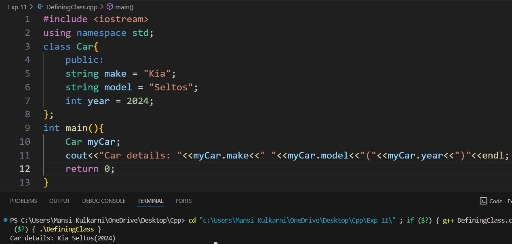
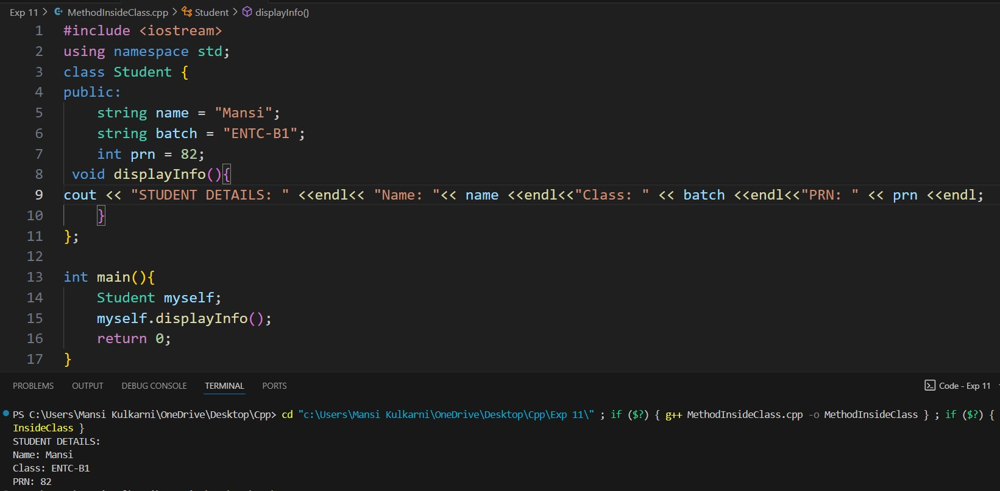
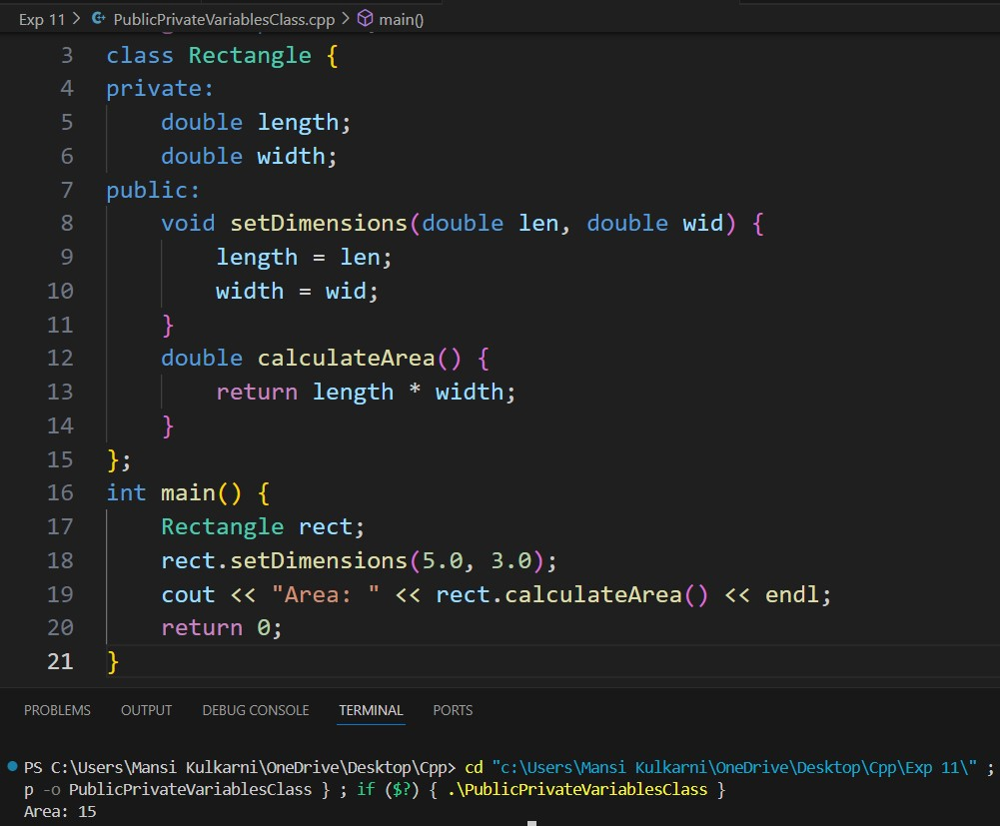
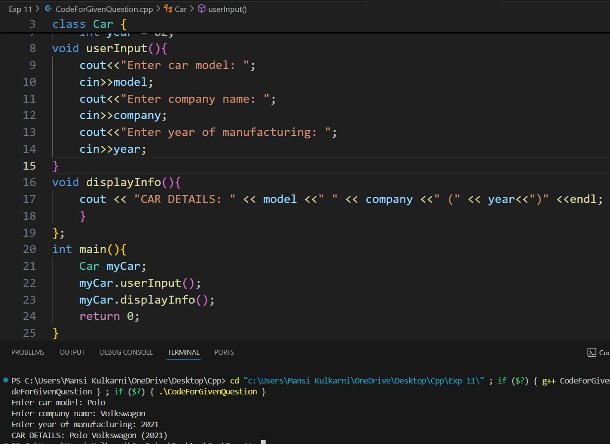

# Experiment 11
## Theory:
A class is a blueprint for creating objects. 
Defining a Class: A class in C++ is a user-defined type that groups data (attributes) and functions (methods) into one unit. It acts as a blueprint for creating objects, which are instances of the class. Classes enable object-oriented principles such as encapsulation and abstraction.
Function/Method Inside a Class: Methods in a class are functions that operate on the class's data members. They define the actions that objects of the class can perform and have access to both public and private members of the class.
Public and Private Variables in Class: Public members are accessible outside the class, while private members are restricted to within the class. Public members allow interaction with the class's data, and private members protect sensitive data from direct access, ensuring encapsulation.

## Program 1
### Aim: 
Defining a Class
### Software used: 
Visual Studio Code
### Output:

### Conclusion:
We learned how to define a class in C++. 

## Program 2
### Aim: 
Function/Method inside Class 
### Software used: 
Visual Studio Code
### Output:

### Conclusion:
We learned about methods inside a class in C++. 

## Program 3
### Aim: 
Concept of Public and Private Variables in Class
### Software used: 
Visual Studio Code
### Output:

### Conclusion:
We learned about the types of variables inside a class in C++.

## Program 4
### Aim: 
To write code for the given output
### Software used: 
Visual Studio Code
### Output:

### Conclusion:
We learned how to use classes to write the required code. 
